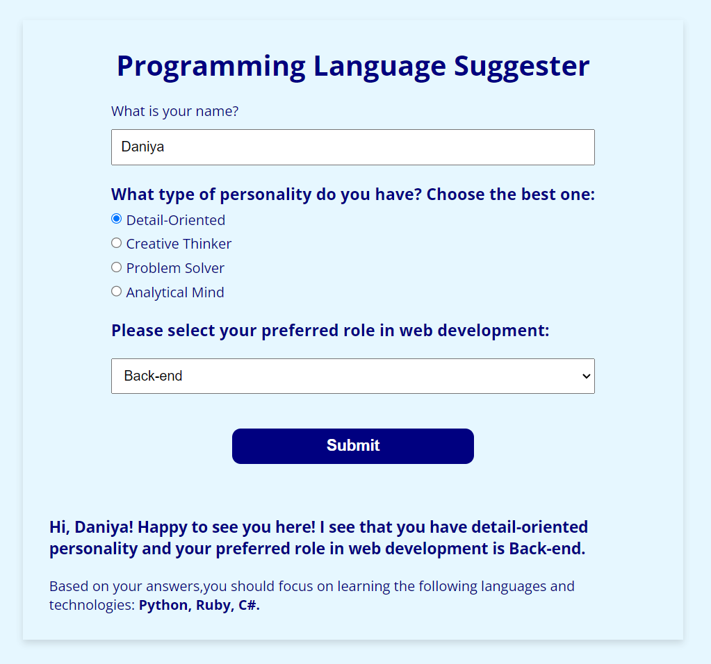

## 
Programming language Suggester

#### 
📚 _Learning project for practicing JavaScript and Web Browsers  11/04/2023_ 

**_
By Daniya Yelemessova_**

  

## 
 🛠️ _Technologies used:_

- HTML
- CSS
- JavaScript
- Visual Studio Code
- GIT

### 
 🤔 Description:

The "Programming Language Suggester" is a web application that helps prospective coders decide which programming language they should learn first. This project is created using HTML, CSS, JavaScript, and Web APIs. The application asks users a series of questions about themselves and provides a programming language suggestion based on their answers. It aims to make the learning process more enjoyable and personalized.

